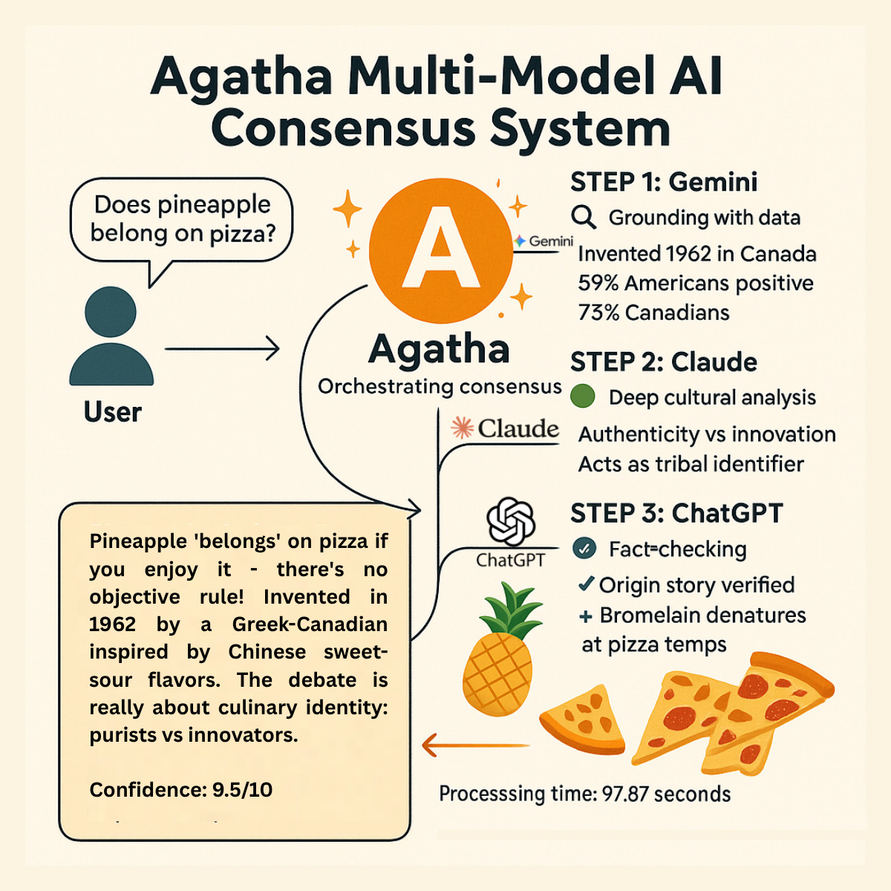

# 🔮 Agatha: Multi-Model AI Consensus System

Agatha is a powerful CLI tool that combines multiple AI models to provide comprehensive, well-reasoned answers through a 4-step consensus pipeline. By leveraging the unique strengths of different AI models, Agatha produces more robust and nuanced analyses than any single model could provide alone.



## ✨ Features

- **Multi-Model Pipeline**: 4-step consensus process using different AI models for specialized tasks
- **Google Search Grounding**: Real-time factual grounding using Google Search in Step 1
- **Clean CLI Output**: Minimal console interface showing only essential progress information
- **Comprehensive Logging**: Detailed logs of all LLM interactions saved to timestamped files
- **Multi-Provider Support**: Works with OpenRouter, Google Gemini, Anthropic Claude, and OpenAI
- **Graceful Interruption**: Clean Ctrl+C handling for smooth user experience
- **API Key Validation**: Automatic verification of all required API keys at startup

## 🏗️ Architecture

Agatha processes questions through a 4-step pipeline:

1. **🔍 Step 1: Gemini Flash - Factual Grounding**
   - Uses Google Search tool for real-time fact-checking
   - Provides foundational data and current information
   - Temperature: 0.3 (focused on accuracy)

2. **🧠 Step 2: Claude Opus - Deep Analysis**
   - Performs sophisticated reasoning and analysis
   - Explores implications and multiple perspectives
   - Temperature: 0.7 (balanced creativity and logic)

3. **✅ Step 3: GPT-4o-mini - Fact-checking & Proofreading**
   - Verifies claims and corrects inaccuracies
   - Ensures logical consistency
   - Temperature: 0.3 (focused on precision)

4. **🔄 Step 4: Gemini Pro - Synthesis & Consensus**
   - Combines all perspectives into a final answer
   - Identifies areas of consensus and divergence
   - Temperature: 0.5 (balanced synthesis)

## 🚀 Quick Start

### Prerequisites

- Python 3.8 or higher
- API keys for your chosen providers (see Configuration section)

### Installation

1. **Clone the repository:**
   ```bash
   git clone <repository-url>
   cd agatha
   ```

2. **Set up Python virtual environment:**
   ```bash
   python -m venv venv
   source venv/bin/activate  # On Windows: venv\Scripts\activate
   ```

3. **Install dependencies:**
   ```bash
   pip install -r requirements.txt
   ```

4. **Configure API keys:**
   ```bash
   cp template.env .env
   # Edit .env with your API keys (see Configuration section)
   ```

5. **Run Agatha:**
   ```bash
   python agatha_cli.py
   ```

## ⚙️ Configuration

### Environment Variables

Copy `template.env` to `.env` and configure the following:

```bash
# Step Configuration
MODEL_STEP1=gemini-2.5-flash          # Grounding model
MODEL_STEP1_PROVIDER=google           # Must be 'google' for grounding
TEMPERATURE_STEP1=0.3

MODEL_STEP2=anthropic/claude-opus-4   # Analysis model
MODEL_STEP2_PROVIDER=openrouter
TEMPERATURE_STEP2=0.7

MODEL_STEP3=openai/o4-mini           # Fact-checking model
MODEL_STEP3_PROVIDER=openrouter
TEMPERATURE_STEP3=0.3

MODEL_STEP4=google/gemini-2.5-pro    # Synthesis model
MODEL_STEP4_PROVIDER=openrouter
TEMPERATURE_STEP4=0.5

# API Keys
OPENROUTER_API_KEY=your_openrouter_key_here
GOOGLE_API_KEY=your_google_api_key_here
ANTHROPIC_API_KEY=your_anthropic_key_here  # Optional
OPENAI_API_KEY=your_openai_key_here        # Optional
```

### API Key Requirements

- **OpenRouter**: Required for most models (get key at [openrouter.ai](https://openrouter.ai))
- **Google**: Required for Step 1 grounding (get key at [Google AI Studio](https://makersuite.google.com/app/apikey))
- **Anthropic**: Optional, only if using direct Anthropic provider
- **OpenAI**: Optional, only if using direct OpenAI provider

## 📖 Usage

### Basic Usage

1. Start Agatha:
   ```bash
   python agatha_cli.py
   ```

2. Enter your question when prompted:
   ```
   Enter your question (or type 'exit' to quit):
   > Are AI coding assistants making developers better or just more dependent?
   ```

3. Watch the pipeline process your question:
   ```
   Step 1: gemini-2.5-flash via google - Grounding... ✓
   Step 2: anthropic/claude-opus-4 via openrouter - Analysis... ✓
   Step 3: openai/o4-mini via openrouter - Fact-check & Proofread... ✓
   Step 4: google/gemini-2.5-pro via openrouter - Synthesis & Consensus... ✓
   ```

4. Review the comprehensive analysis with multiple perspectives and final consensus.

### Commands

- **Exit**: Type `exit`, `quit`, or `q` to close Agatha
- **Interrupt**: Press `Ctrl+C` for graceful shutdown
- **Logs**: Check `agatha_YYYYMMDD_HHMM.log` for detailed interaction logs

## 📁 Project Structure

```
agatha/
├── agatha_cli.py           # Main CLI application
├── system_prompt1.md       # Gemini Flash grounding prompt
├── system_prompt2.md       # Claude Opus analysis prompt
├── system_prompt3.md       # GPT-4o-mini fact-checking prompt
├── system_prompt4.md       # Gemini Pro synthesis prompt
├── requirements.txt        # Python dependencies
├── template.env           # Environment template
├── .env                   # Your API keys (create from template)
├── .gitignore            # Git ignore rules
├── README.md             # This file
├── example.md            # Example: AI coding assistants
├── example2.md           # Example: AGI vs quantum computers
├── example3.md           # Example: Pineapple on pizza
└── agatha_*.log          # Generated log files
```

## 📊 Example Outputs

See the included example files for complete analyses:

- **[example.md](example.md)**: "Are AI coding assistants making developers better or just more dependent?"
- **[example2.md](example2.md)**: "Which will happen first: AGI or useful quantum computers?"
- **[example3.md](example3.md)**: "Does pineapple belong on a pizza?"

Each example demonstrates Agatha's ability to:
- Gather factual information with sources
- Provide deep analytical perspectives
- Perform rigorous fact-checking
- Synthesize multiple viewpoints into a balanced conclusion

## 🔧 Customization

### Adding New Models

1. Update the model configuration in `.env`
2. Ensure the provider supports the model
3. Adjust temperature settings as needed

### Modifying System Prompts

Edit the `system_prompt*.md` files to customize how each model approaches its task:

- `system_prompt1.md`: Factual grounding instructions
- `system_prompt2.md`: Deep analysis guidelines
- `system_prompt3.md`: Fact-checking criteria
- `system_prompt4.md`: Synthesis methodology

### Provider Configuration

Each step can use a different provider:
- `google`: Direct Google Gemini API (required for Step 1 grounding)
- `openrouter`: Access to multiple models via OpenRouter
- `anthropic`: Direct Anthropic Claude API
- `openai`: Direct OpenAI GPT API

## 🛠️ Dependencies

- `python-dotenv`: Environment variable management
- `requests`: HTTP API calls
- `google-genai`: Google Gemini API with Search tools

## 📝 Logging

Agatha generates comprehensive logs:

- **Console**: Minimal progress information only
- **Log Files**: Complete interaction details including:
  - All prompts sent to models
  - Full model responses
  - API request/response data
  - Timing information
  - Error details

Log files are named `agatha_YYYYMMDD_HHMM.log` and stored in the project directory.

## 🚨 Troubleshooting

### Common Issues

1. **API Key Errors**:
   - Verify keys in `.env` file
   - Check key format and validity
   - Ensure sufficient credits/quota

2. **Model Not Available**:
   - Check if model is supported by provider
   - Verify model name spelling
   - Try alternative models

3. **Network Issues**:
   - Check internet connection
   - Verify firewall settings
   - Try again later if providers are experiencing issues

4. **Grounding Issues**:
   - Ensure Step 1 uses `google` provider
   - Verify Google API key is valid
   - Check if Google Search tool is enabled

### Getting Help

- Check log files for detailed error information
- Verify configuration against `template.env`
- Ensure all dependencies are installed correctly

## 🤝 Contributing

Contributions are welcome! Please:

1. Fork the repository
2. Create a feature branch
3. Make your changes
4. Add tests if applicable
5. Submit a pull request

## 📄 License

This project is licensed under the MIT License - see the LICENSE file for details.

## 🙏 Acknowledgments

- OpenRouter for multi-model API access
- Google for Gemini models and Search grounding
- Anthropic for Claude models
- OpenAI for GPT models

---

**Built with ❤️ for better AI consensus and decision-making**
